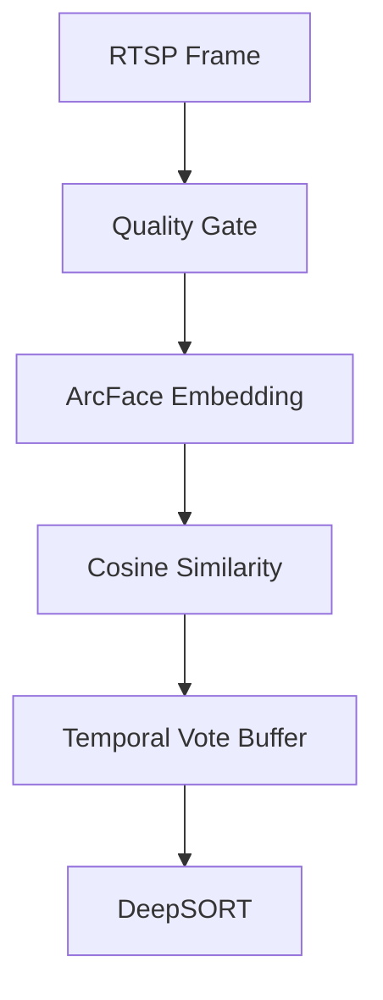
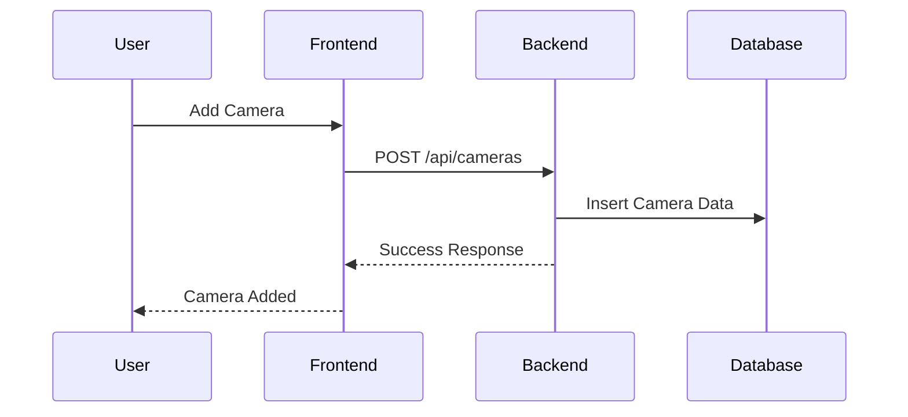

# Project Overview

## Executive Summary

### Project Overview
FaceGuard Pro is a production-grade CCTV face recognition system designed for real-time surveillance. It leverages advanced technologies like YOLOv8 for face detection, ArcFace for face recognition, and DeepSORT for object tracking. The system is built to provide accurate and efficient face recognition for security and monitoring purposes.

### Key Findings
- **System Maturity**: The project is well-structured and production-ready, with a clear separation of backend and frontend components.
- **Technology Stack**: Utilizes modern frameworks and libraries, ensuring scalability and maintainability.
- **Performance**: Optimized for real-time processing with GPU support.
- **Security**: Implements basic security measures but could benefit from additional hardening.
- **Scalability**: Designed to handle multiple camera streams and real-time processing.

---

## Technical Documentation

### System Architecture
- **Architecture Type**: Modular Monolith
- **Backend**: FastAPI for API and WebSocket endpoints.
- **Frontend**: React for user interface.
- **Database**: SQLite for persistence.
- **Deployment**: Dockerized for portability.

#### Data Flow
1. RTSP Frame → Process every 3rd frame.
2. Quality Gate → Filters based on blur, size, and angle.
3. ArcFace Embedding → Generates 512-d embeddings.
4. Cosine Similarity → Matches embeddings with a threshold of 0.55.
5. Temporal Vote Buffer → Smooths recognition over 5/10 frames.
6. DeepSORT → Tracks bounding boxes.

#### Component Interaction
- **Frontend**: Handles user interactions and displays real-time data.
- **Backend**: Processes video streams, manages database, and serves APIs.
- **Database**: Stores employee data, camera configurations, and event logs.

### Technology Stack
- **Frontend**: React, Axios, WebSocket
- **Backend**: FastAPI, SQLite, YOLOv8, ArcFace
- **DevOps**: Docker, Nginx

### Features
1. **Camera Management**: Add, edit, delete RTSP cameras.
2. **Employee Registration**: Register employees with multiple face photos.
3. **Live Feed**: Real-time face recognition and tracking.
4. **Event History**: View detection logs with snapshots.

---

## Risk Assessment

### Security Risks
- **XSS**: Potential vulnerabilities in frontend forms.
- **CSRF**: Lack of CSRF tokens in API requests.
- **SQL Injection**: SQLite queries need validation.

### Performance Risks
- **Heavy Queries**: Potential bottlenecks in event history retrieval.
- **Unoptimized Loops**: Backend processing loops could be optimized.

### Scalability Concerns
- **Database**: SQLite may not scale for high-concurrency scenarios.
- **Real-Time Processing**: Limited by CPU/GPU resources.

---

## Improvement Recommendations

### Refactoring Suggestions
- Modularize backend components for better maintainability.
- Optimize database queries and indexing.

### Optimization Ideas
- Implement caching for frequently accessed data.
- Use a message queue for asynchronous processing.

### Future Architecture Improvements
- Migrate to a distributed database for scalability.
- Introduce microservices for independent scaling of components.

---

## Developer Knowledge Transfer

### How the System Works
1. **Backend**: Processes video streams, manages data, and serves APIs.
2. **Frontend**: Provides an interface for users to interact with the system.
3. **Database**: Stores all persistent data.

### How to Extend Features
- Add new endpoints in `main.py`.
- Create new React components for frontend features.

### How to Debug Issues
- Use FastAPI's interactive docs for API testing.
- Check logs in Docker containers for errors.

### Best Practices for Contributors
- Follow PEP 8 for Python code.
- Use meaningful commit messages.
- Write unit tests for new features.

---

## Workflow Diagrams

### Data Flow Diagram

### Request Lifecycle

---

## Future Roadmap
1. **Enhance Security**: Add OAuth2 authentication and input validation.
2. **Improve Performance**: Introduce GPU acceleration for all models.
3. **Scalability**: Transition to a cloud-based database.
4. **New Features**: Add support for face mask detection.

---

## Conclusion
FaceGuard Pro is a robust and scalable system for real-time face recognition. With targeted improvements in security, performance, and scalability, it can serve as a reliable solution for production surveillance systems.